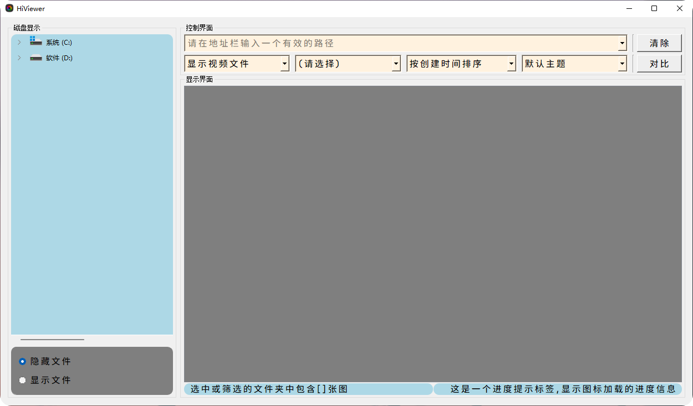
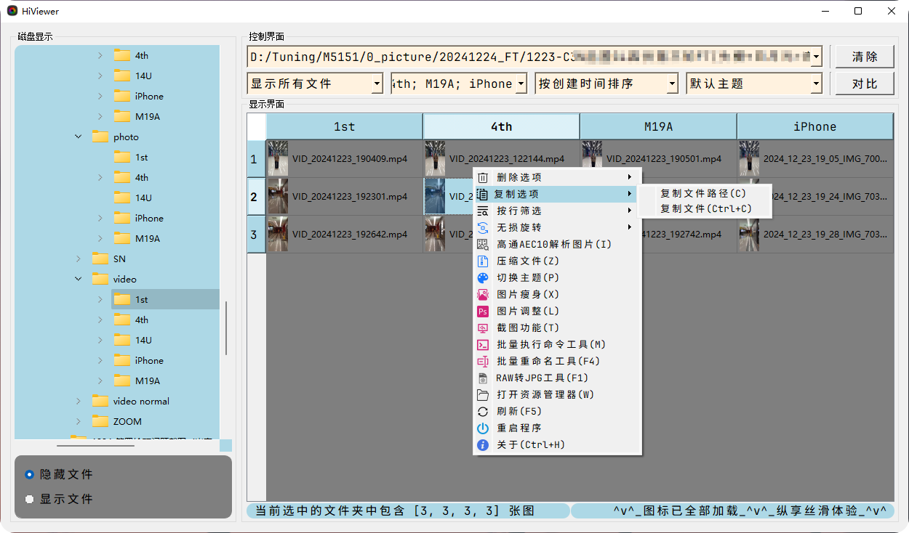
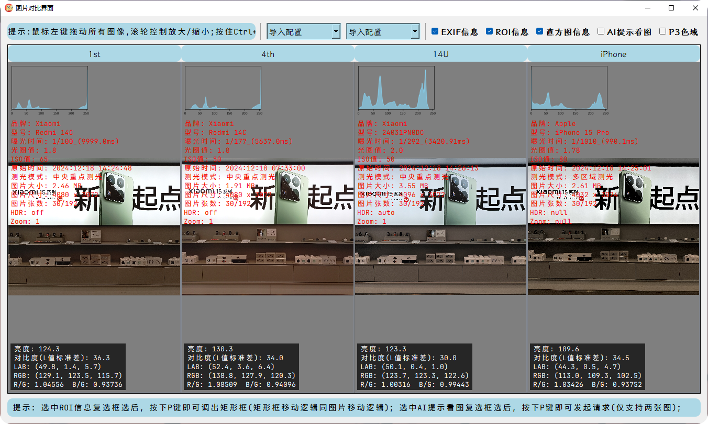
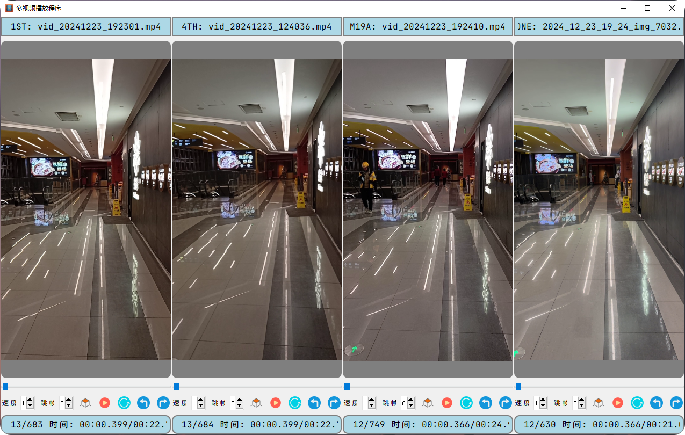

<p align="right">
   <strong>中文</strong> | <a href="./README.en.md">English</a>
</p>

<div align="center">

# 📷 hiviewer


**hiviewer**是一款多功能**图片&视频**比较工具，采用 **Python + PyQt5** 实现，旨在为用户提供更便捷的图片&视频对比方案。

<p align="center">
  <a href="https://www.python.org/">
    
  </a>
  <a href="https://platform.openai.com/">
    
  </a>
  <a href="https://raw.githubusercontent.com/yourusername/xianyubot/main/LICENSE">
    
  </a>
</p>

</div>

## 项目结构

```

hiviewer/
├── resource/           # 存在资源文件
│   ├── icons/          # 存放ico图标
│   ├── docs/           # 存放说明文档
│   ├── fonts/          # 存放自定义字体 
│   ├── tools/          # 存放一些exe类工具
│   └── installer.exe   # 存放独立打包的exe文件
├── src/                # 存在项目主要功能模块
│   ├── __init__.py
│   ├── common/          # 存在公共模块
│   │   ├── __init__.py  # 公共模块初始化
│   │   └── ...
│   ├── components/      # 存在组件模块
│   │   ├── __init__.py  # 组件模块初始化
│   │   └── ...
│   ├── utils/           # 存放自定义的功能模块
│   │   ├── __init__.py  # 自定义功能模块初始化
│   │   └── ...
│   └── view/          # 存放各个子界面功能模块
│       ├── __init__.py  # 子界面功能模块初始化
│       └── ...
├── test/               # 存在测试代码
│   ├── __init__.py
│   └── ...
├── .gitignore          # 忽略文件
├── README.en.md        # 英文说明文档
├── README.md           # 中文说明文档
├── LICENSE             # 许可证
├── requirements.txt    # 三方库依赖
├── generate_exe.py     # 打包exe可执行文件
└── hiviewer.py         # 项目主函数


````

## 使用说明

### 环境配置

```bash
# 安装依赖（清华源）
conda create -n hiviewer python=3.11
conda activate hiviewer
pip3 install -r requirements.txt -i https://pypi.tuna.tsinghua.edu.cn/simple

# 运行程序
python hiviewer.py

# 打包exe可执行文件
pip install nuitka==2.5.0
python generate_exe.py
另：也可以使用 auto-py-to-exe 调出图形打包界面，可平替pyinstaller

````

### 安装包下载

#### Windows 用户

1. 下载 "[latest.zip](https://github.com/diamond-cz/Hiviewer_releases/releases/)" 压缩包
2. 解压后，双击程序"hiviewer.exe"运行

#### macOS 用户

暂未维护

### 效果展示

> 新的版本会有新的变化，此处仅供参考，详细地使用说明请点一下 [这里](https://github.com/diamond-cz/hiviewer_releases) ，不麻烦`-_-)o`

**主界面展示**





**看图界面展示**



**视频播放界面展示**



### 技术实现


## 许可证

本项目采用 **GPL 3.0** ([GNU通用公共许可协议](https://jxself.org/translations/gpl-3.zh.shtml))进行许可，支持自由使用与修改，但是必须公开修改后源码。
有关详细信息，请参阅 [LICENSE](LICENSE) 文件。

[](https://jxself.org/translations/gpl-3.zh.shtml)
